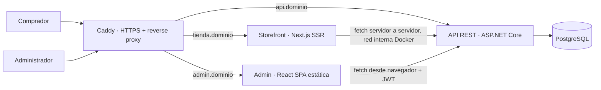
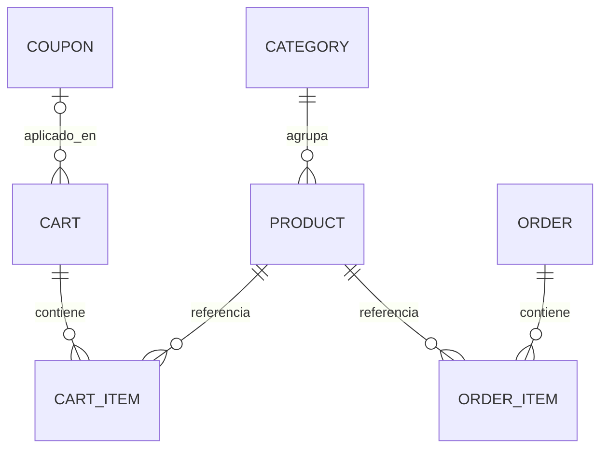

# Retail Store — Plan de alcance, arquitectura y fases

> Reto técnico: Desarrollador Full Stack · Documento de planificación v1.0 · 21-09-2026

---

## Estado de este documento

**Es el plan original y varias de sus secciones ya no describen el proyecto.**
Se conserva porque registra de dónde salió cada cosa, no porque haya que
seguirlo. Cuando contradiga a otro documento, manda el otro:

| Sección de aquí | Quedó superada por | Qué cambió |
| --- | --- | --- |
| §2.4, §2.6 — backend | [ADR-0005](adr/0005-backend-solo-java.md) | El backend es **solo Java**. La recomendación de ASP.NET Core queda como el razonamiento que llevó a preguntarlo |
| §2.3, §4.1 — categorías | [ADR-0006](adr/0006-categorias-dos-niveles.md) | Dos niveles: categoría y subcategoría. Los productos cuelgan de la subcategoría |
| §3 «Won't» — registro de compradores | [ADR-0008](adr/0008-cuentas-solo-clientes.md) | Los clientes **sí** tienen cuenta. Lo que no la tiene por registro público es el administrador |
| §6 — modelo de datos | [negocio/modelo-dominio.md](negocio/modelo-dominio.md) | El modelo creció: marcas, subcategorías, SKU, archivos con variantes, auditoría |
| §7 — API REST | [`contracts/openapi.yaml`](../contracts/openapi.yaml) | El contrato se genera desde la aplicación y está en español |
| §4.4 — administración «Could» | [estado-y-brecha.md](estado-y-brecha.md) | Dejó de ser opcional: el módulo de administración está hecho |
| §11 — plan por fases | [estado-y-brecha.md](estado-y-brecha.md) §4 | El orden de lo que falta se lleva allí, junto al estado real |

Lo que **sigue vigente**: §1 (lectura del reto), §5 (requisitos no
funcionales), §8 (estructura del monorepo), §9 (manejo de estado), §10
(despliegue) y §12 (riesgos).

---

## 1. Lectura del reto

### 1.1 Lo obligatorio

| Tema | Exigencia |
|---|---|
| Funcional | Home con productos, detalle básico, agregar / eliminar / actualizar cantidad en carrito, resumen con cantidades y precios, totales en tiempo real |
| Frontend | **React**, estado con `useState` / `useReducer` o equivalente, CSS puro o Tailwind, responsive |
| Backend | Java + Spring Boot **o** C# + ASP.NET Core, exponiendo API REST |
| Arquitectura | Separación real frontend / backend comunicados por REST |
| Entrega | Repo público + app desplegada, enviados 2 h antes de la entrevista |
| Entrevista | Explicar arquitectura, estado, APIs, validaciones, librerías y todo código hecho con IA |

### 1.2 Implicancias que condicionan el diseño

1. **Evalúan 7 criterios y solo 1 es "features".** Calidad de código, estructura, validaciones, documentación y UX pesan igual. Pocas funcionalidades bien hechas valen más que muchas a medias.
2. **"Separación frontend/backend por REST"** → Next.js no puede actuar como backend. Nada de lógica de negocio en Route Handlers ni Server Actions; todo dato sale de la API .NET/Spring.
3. **"Manejo del estado con useState/useReducer"** → el carrito debe tener un `useReducer` visible y defendible. Si todo se resuelve con Server Components, el evaluador no ve manejo de estado.
4. **"Poder explicar todo"** → cada decisión de este documento debe quedar registrada (sección 13) para ensayarla.

---

## 2. Decisiones de arquitectura

### 2.1 Vista general



El navegador del comprador también llama directo a `api.dominio` para las operaciones de carrito y checkout (componentes cliente).

### 2.2 Dónde Next.js y dónde React SPA

| App | Tecnología | Render | Por qué |
|---|---|---|---|
| **Storefront** (tienda pública) | Next.js, App Router | SSR / ISR + islas cliente | SEO de catálogo y detalle, primer pintado rápido en móvil, metadatos Open Graph por producto, URLs compartibles con filtros |
| **Admin** (gestión) | React + Vite + React Router | CSR puro | Va detrás de login (SEO irrelevante), es interacción pesada (tablas, formularios), se despliega como estáticos sin proceso Node, build y DX más simples |

**Valoración del planteamiento SSR tienda / CSR admin:** es correcto y es el patrón habitual en e-commerce. Tres condiciones para que juegue a favor en la evaluación:

- Next.js **es** React, así que cumple el requisito, pero hay que decirlo explícito en el README para que nadie lo lea como "no usó React".
- El admin **no está en los requisitos mínimos**. Es una mejora, por eso va en la Fase 6 y es lo primero que se recorta si el tiempo aprieta.
- Dos frontends = doble setup, doble deploy. Se compensa con monorepo y tipos generados desde OpenAPI (sección 8).

### 2.3 Estrategia de render por ruta (Storefront)

| Ruta | Estrategia | Detalle |
|---|---|---|
| `/` | ISR (`revalidate: 60`) | Destacados, categorías, promociones. Server Component |
| `/productos` | SSR dinámico | Lee `searchParams` (búsqueda, categoría, precio, orden, página). Filtros = URL → compartible e indexable |
| `/productos/[slug]` | ISR + `generateMetadata` | Detalle, relacionados, JSON-LD de producto |
| `/categorias/[slug]` | ISR | Listado por categoría |
| `/carrito` | Cliente | `useReducer` + sincronización con API |
| `/checkout` | Cliente | Formulario validado, crea la orden |
| `/pedido/[numero]` | SSR | Confirmación |
| `/favoritos` | Cliente | `localStorage` |

Componentes cliente dentro de páginas servidor: botón "Agregar al carrito", selector de cantidad, corazón de favoritos, badge del carrito en el header, buscador con debounce, toasts.

### 2.4 Backend

> **Superado por [ADR-0005](adr/0005-backend-solo-java.md): el backend es solo
> Java.** Lo de abajo es el análisis que llevó a preguntarlo, y la nota al final
> —«elegir el stack del evaluador suma más que cualquier ventaja técnica»— es
> justo la que decidió.

**Recomendación: ASP.NET Core (.NET LTS vigente) + EF Core + Npgsql.**

- Menor consumo de RAM que una JVM en un VPS chico (importante si conviven 4 contenedores).
- `ProblemDetails` + `IExceptionHandler` nativos para errores uniformes; rate limiting nativo.
- Migraciones y seeding con EF Core resueltos en minutos.

> Si sabes que el stack de la empresa es Java, cambia a Spring Boot sin dudar: el diseño mapea 1:1 (Controllers / Services / Repositories JPA, Bean Validation, `@RestControllerAdvice`, Flyway, springdoc-openapi). Elegir el stack del evaluador suma más que cualquier ventaja técnica.

Arquitectura en capas pragmática (no Clean Architecture completa: sería sobreingeniería para un prototipo y difícil de justificar):

```
backend/
  RetailStore.Api/            Controllers, middlewares, DI, config
  RetailStore.Application/    Servicios, DTOs, validadores, interfaces
  RetailStore.Domain/         Entidades y reglas (precios, cupones, stock)
  RetailStore.Infrastructure/ DbContext, repos, migraciones, seed
  RetailStore.Tests/          xUnit
```

### 2.5 Base de datos

| Opción | Pros | Contras | Veredicto |
|---|---|---|---|
| **PostgreSQL** (Docker) | Un servicio más en `docker-compose`, `numeric` exacto para dinero, transacciones sólidas para stock, full-text search gratis, es lo que se usaría en producción | Un contenedor extra (~100 MB RAM) | **Elegida** |
| SQLite | Cero operación, un archivo en un volumen | Escrituras concurrentes limitadas, se ve "de juguete" en una prueba full stack | **Plan B** si el tiempo aprieta: con EF Core es cambiar el provider |
| MySQL / MariaDB | Conocida | Sin ventaja frente a Postgres aquí | Descartada |

Reglas: dinero siempre `numeric(12,2)` / `decimal`, nunca `float`. Puerto 5432 **no** expuesto a internet, solo red interna Docker. Volumen persistente + `pg_dump` diario por cron.

### 2.6 Stack resumido

| Capa | Elección |
|---|---|
| Storefront | Next.js (App Router) · TypeScript · Tailwind CSS · `useReducer` + Context · Zod · sonner (toasts) |
| Admin | React + Vite · TypeScript · Tailwind · React Router · TanStack Query · React Hook Form + Zod |
| API | ASP.NET Core · EF Core · FluentValidation · JWT Bearer · OpenAPI + Swagger UI/Scalar |
| BD | PostgreSQL |
| Infra | VPS Ubuntu · Docker Compose · Caddy (HTTPS automático) · GitHub Actions |
| Tests | xUnit (dominio y servicios) · Vitest (reducers) |

---

## 3. Alcance (MoSCoW)

### Must — requisitos del reto (MVP)
Catálogo en Home · detalle de producto · agregar / eliminar / cambiar cantidad · resumen del carrito · totales en tiempo real · responsive · API REST · validaciones y errores · repo público · deploy · README.

### Should — mejoras de alto impacto y bajo costo
Búsqueda y filtros · categorías · toasts de acciones · favoritos · persistencia del carrito · cupones y precio tachado · checkout simulado · productos relacionados · skeletons y estados vacíos/error.

### Could — si sobra tiempo
Panel admin completo · dashboard con KPIs · revalidación on-demand del storefront al editar un producto · botón de WhatsApp como "chat de atención" · modo oscuro · subida de imágenes · CI/CD con deploy automático · tests de integración.

### Won't — fuera de alcance (decirlo en el README)
Pasarela de pagos real · multi-moneda / multi-idioma · envíos y courier · facturación electrónica · reseñas de usuarios.

> **Corregido:** «registro/login de compradores» estaba en esta lista y salió de
> ella. Los clientes tienen cuenta; ver
> [ADR-0008](adr/0008-cuentas-solo-clientes.md) y
> [backend/autenticacion.md](backend/autenticacion.md). Sigue sin haber registro
> público de **administradores**, que es otra cosa.

---

## 4. Requerimientos funcionales

### 4.1 Catálogo

| ID | Requerimiento | Prioridad | Criterio de aceptación |
|---|---|---|---|
| RF-01 | Listar productos en Home | Must | Grid responsive con imagen, nombre, precio, rating y botón agregar; paginado |
| RF-02 | Ver detalle de producto | Must | Imagen, descripción, categoría, precio, stock, selector de cantidad; 404 amigable si no existe |
| RF-03 | Navegar por categorías | Should | Menú de categorías; URL propia por categoría |
| RF-04 | Buscar productos | Should | Búsqueda por nombre/descripción con debounce; el término vive en la URL |
| RF-05 | Filtrar y ordenar | Should | Por categoría, rango de precio, solo con stock; orden por precio, nombre, novedad |
| RF-06 | Productos relacionados | Should | En el detalle: hasta 4 de la misma categoría, excluyendo el actual |
| RF-07 | Precio promocional | Should | Si hay `compare_at_price`, mostrar precio tachado y % de descuento |

### 4.2 Carrito

| ID | Requerimiento | Prioridad | Criterio de aceptación |
|---|---|---|---|
| RF-10 | Agregar producto | Must | Desde grid y detalle; si ya existe, suma cantidad; toast de confirmación |
| RF-11 | Eliminar producto | Must | Quita la línea; toast con opción "Deshacer" (Should) |
| RF-12 | Actualizar cantidad | Must | Botones +/− e input; mínimo 1; máximo = stock; valida en cliente y servidor |
| RF-13 | Resumen del carrito | Must | Línea por producto con cantidad, precio unitario y subtotal de línea |
| RF-14 | Totales en tiempo real | Must | Subtotal, descuento, IGV incluido y total se recalculan en cada cambio sin recargar |
| RF-15 | Persistencia | Should | El carrito sobrevive a recargar y cerrar el navegador (`cartId` en `localStorage` + carrito en servidor) |
| RF-16 | Mini-carrito | Should | Drawer lateral desde el header con badge de cantidad |
| RF-17 | Vaciar carrito | Should | Con confirmación |
| RF-18 | Control de stock | Must | Si la cantidad supera el stock, la API responde `409` y la UI lo informa y revierte |

### 4.3 Promociones, checkout y extras

| ID | Requerimiento | Prioridad | Criterio de aceptación |
|---|---|---|---|
| RF-20 | Aplicar cupón | Should | Tipos `%` y monto fijo; valida vigencia, mínimo de compra y usos; mensaje claro si no aplica |
| RF-21 | Checkout simplificado | Should | Una sola página: datos de contacto, dirección, pago simulado; validación por campo |
| RF-22 | Crear orden | Should | Transacción: revalida stock y precios, descuenta stock, guarda snapshot de precios, devuelve número de pedido |
| RF-23 | Confirmación de pedido | Should | Página con resumen y número de pedido |
| RF-24 | Favoritos | Should | Marcar/desmarcar; página de favoritos; persistido en `localStorage` |
| RF-25 | Notificaciones | Should | Toast en agregar, eliminar, cupón, errores de red |
| RF-26 | Atención al cliente | Could | Botón flotante de WhatsApp con mensaje prellenado |

### 4.4 Administración (Could)

| ID | Requerimiento | Criterio de aceptación |
|---|---|---|
| RF-30 | Login de administrador | JWT; rutas protegidas; credenciales demo en el README |
| RF-31 | CRUD de productos | Tabla con búsqueda y paginación; formulario validado; activar/desactivar |
| RF-32 | CRUD de categorías | No permite borrar una categoría con productos |
| RF-33 | CRUD de cupones | Con vigencia y límite de usos |
| RF-34 | Gestión de pedidos | Listado, detalle, cambio de estado |
| RF-35 | Dashboard | Ventas, n.º de pedidos, ticket promedio, top productos, stock bajo |

---

## 5. Requerimientos no funcionales

| ID | Tema | Requisito |
|---|---|---|
| RNF-01 | Responsive | Mobile-first; probado en 360, 768 y 1280 px |
| RNF-02 | Rendimiento | Lighthouse ≥ 90 en Performance y SEO en Home y detalle; `next/image`; paginación en servidor |
| RNF-03 | Validación | Doble: Zod en cliente, FluentValidation en servidor. El servidor nunca confía en precios ni totales enviados por el cliente |
| RNF-04 | Errores | Formato único `application/problem+json` (RFC 7807); `400` validación, `404` no existe, `409` stock/conflicto, `401/403` admin, `500` sin stack trace |
| RNF-05 | Seguridad | CORS restringido a los dos orígenes; JWT para admin; hash de contraseñas; rate limiting; secretos por variables de entorno; HTTPS |
| RNF-06 | Accesibilidad | HTML semántico, foco visible, `aria-label` en botones de icono, contraste AA |
| RNF-07 | UX | Skeletons, estados vacío / error / sin resultados, UI optimista en carrito |
| RNF-08 | Mantenibilidad | TypeScript estricto, ESLint + Prettier, nombres consistentes, sin duplicación entre apps (tipos generados) |
| RNF-09 | Documentación | README raíz, OpenAPI navegable, ADRs cortos, `.env.example` |
| RNF-10 | Observabilidad | Logs estructurados, endpoint `/health` |
| RNF-11 | Localización | Moneda PEN (`S/`), precios con IGV incluido y desglose en el resumen |

---

## 6. Modelo de datos



| Tabla | Campos clave |
|---|---|
| `categories` | id, name, slug (único), image_url, is_active |
| `products` | id, category_id, name, slug (único), description, price, compare_at_price (null), stock, image_url, rating_avg, rating_count, is_featured, is_active, created_at, updated_at |
| `carts` | id (UUID), coupon_id (null), status (ACTIVE / CONVERTED), created_at, updated_at |
| `cart_items` | id, cart_id, product_id, quantity · `UNIQUE(cart_id, product_id)` |
| `coupons` | id, code (único), type (PERCENT / FIXED), value, min_subtotal, starts_at, ends_at, max_uses, used_count, is_active |
| `orders` | id, order_number, customer_name, email, phone, address, subtotal, discount, total, coupon_code, status, created_at |
| `order_items` | id, order_id, product_id, product_name, unit_price, quantity, line_total |
| `admin_users` | id, email, password_hash, role |

Decisiones a defender:

- `cart_items` **no guarda precio**: el carrito siempre refleja el precio vigente del producto.
- `order_items` **sí guarda snapshot** de nombre y precio: una orden no cambia si luego se edita el producto.
- Carrito anónimo identificado por UUID: no obliga a registrarse y aun así el servidor es la fuente de verdad.
- Seed inicial: ~30 productos en 5–6 categorías, 2 cupones demo, 1 usuario admin.

---

## 7. API REST

Base: `/api/v1` · JSON · camelCase · paginación `page` / `pageSize` con `totalItems` y `totalPages`.

### 7.1 Públicos

| Método | Endpoint | Descripción |
|---|---|---|
| GET | `/products?search=&category=&minPrice=&maxPrice=&inStock=&sort=&page=&pageSize=` | Listado paginado con filtros |
| GET | `/products/{slug}` | Detalle |
| GET | `/products/{slug}/related` | Relacionados |
| GET | `/categories` | Categorías activas |
| POST | `/carts` | Crea carrito, devuelve `cartId` |
| GET | `/carts/{cartId}` | Carrito con líneas y totales |
| POST | `/carts/{cartId}/items` | `{ productId, quantity }` — agrega o suma |
| PATCH | `/carts/{cartId}/items/{itemId}` | `{ quantity }` |
| DELETE | `/carts/{cartId}/items/{itemId}` | Elimina línea |
| DELETE | `/carts/{cartId}/items` | Vacía carrito |
| POST | `/carts/{cartId}/coupon` | `{ code }` |
| DELETE | `/carts/{cartId}/coupon` | Quita cupón |
| POST | `/orders` | `{ cartId, customer, ... }` — checkout |
| GET | `/orders/{orderNumber}` | Confirmación |
| GET | `/health` | Healthcheck |

Toda mutación del carrito **devuelve el carrito completo con totales recalculados**: un solo contrato, un solo lugar donde vive la regla de precios.

### 7.2 Admin (JWT)

`POST /auth/login` · CRUD en `/admin/products`, `/admin/categories`, `/admin/coupons` · `GET /admin/orders`, `PATCH /admin/orders/{id}/status` · `GET /admin/dashboard`.

### 7.3 Formato de error

```json
{
  "type": "https://retailstore/errors/insufficient-stock",
  "title": "Stock insuficiente",
  "status": 409,
  "detail": "Solo quedan 3 unidades de 'Mochila Urbana'.",
  "errors": { "quantity": ["Máximo permitido: 3"] }
}
```

---

## 8. Estructura del repositorio (monorepo)

```
retail-store/
  apps/
    storefront/                 Next.js
      app/                      rutas (server components)
      components/               ui/, product/, cart/, layout/
      features/cart/            CartProvider, cartReducer, cartApi, hooks
      features/wishlist/
      lib/                      api client, formatters (PEN), schemas Zod
    admin/                      React + Vite
      src/pages/  src/features/  src/components/  src/lib/
  backend/                      solución .NET (sección 2.4)
  packages/
    api-types/                  tipos TS generados con openapi-typescript
  deploy/
    docker-compose.yml  Caddyfile  .env.example  backup.sh
  docs/
    adr/                        decisiones de arquitectura (1 página c/u)
    PLAN.md                     este documento
  README.md
```

---

## 9. Manejo de estado (punto que preguntarán)

| Estado | Dónde vive | Herramienta |
|---|---|---|
| Catálogo, detalle | Servidor (Server Components) | `fetch` con `revalidate` — no es estado de cliente |
| Filtros y búsqueda | URL | `searchParams` + `useRouter` |
| **Carrito** | Cliente + servidor | **`useReducer` + Context**, sincronizado con la API |
| Favoritos | Cliente | `useReducer` + `localStorage` |
| Formularios | Local | React Hook Form / `useState` |
| Datos del admin | Caché de servidor | TanStack Query |

**Flujo del carrito (UI optimista):**

1. El usuario pulsa "+". Se despacha `SET_QTY` → el reducer actualiza cantidad y **recalcula totales localmente al instante**.
2. En paralelo sale el `PATCH` a la API.
3. Éxito → `SYNC_SUCCESS` reemplaza el estado con el carrito autoritativo del servidor (cubre cupones, precios actualizados, redondeos).
4. Error (`409` stock, red) → `SYNC_ERROR` revierte al snapshot previo y dispara un toast.

Acciones del reducer: `HYDRATE`, `ADD_ITEM`, `REMOVE_ITEM`, `SET_QTY`, `CLEAR`, `APPLY_COUPON`, `REMOVE_COUPON`, `SYNC_SUCCESS`, `SYNC_ERROR`. El reducer es función pura → se testea con Vitest en minutos y es lo más fácil de explicar en la entrevista.

---

## 10. Despliegue en VPS

| Servicio | Imagen / origen | Notas |
|---|---|---|
| `caddy` | `caddy:alpine` | Reverse proxy, certificados Let's Encrypt automáticos, sirve los estáticos del admin |
| `storefront` | Build Next.js con `output: 'standalone'` | Puerto interno 3000 |
| `api` | `dotnet/aspnet` multi-stage | Puerto interno 8080; aplica migraciones y seed al arrancar |
| `db` | `postgres:alpine` | Volumen nombrado; sin puerto publicado |

- Subdominios: `tienda.`, `admin.`, `api.` (3 registros A al mismo VPS).
- Dos variables de API en el storefront: `API_URL_INTERNAL=http://api:8080` para el fetch de servidor (no sale a internet) y `NEXT_PUBLIC_API_URL=https://api.dominio` para el navegador.
- Recursos mínimos: 2 GB RAM, 1–2 vCPU.
- CI/CD (Could): GitHub Actions → build de imágenes → GHCR → `ssh` + `docker compose pull && up -d`.
- Hardening mínimo: UFW con 22/80/443, acceso SSH por llave, `.env` fuera del repo.

---

## 11. Plan por fases

Estimado en jornadas de ~6–8 h. Total: 8,5–9,5 jornadas para todo; **el MVP evaluable queda listo al cerrar la Fase 4 (≈4,5 jornadas).**

### Fase 0 — Definición y setup · 0,5 j
- Confirmar stack de backend y fecha límite.
- Crear monorepo, README inicial, convención de commits, ESLint/Prettier, `.editorconfig`.
- Elegir referencia visual y definir tokens de diseño (paleta, tipografía, espaciados).
- **Salida:** repo público con estructura vacía y este plan en `docs/`.

### Fase 1 — Backend de catálogo · 1 j
- Solución .NET por capas, EF Core + Postgres, migración inicial, seed.
- Endpoints de productos y categorías con filtros, orden y paginación.
- Manejo global de errores (ProblemDetails), validación, CORS, OpenAPI, `/health`.
- **Salida:** Swagger navegable con datos reales; tests de filtros.

### Fase 2 — Esqueleto desplegado · 0,5 j
- `docker-compose`, Caddy, DNS, HTTPS; API + BD arriba en el VPS.
- Storefront "hola mundo" consumiendo `/products` en producción.
- **Salida:** las 2 URLs públicas funcionando. *Desplegar temprano elimina el mayor riesgo de la entrega.*

### Fase 3 — Storefront: catálogo SSR · 1 j
- Layout (header, footer, navegación), Home, listado, detalle con `generateMetadata`.
- Componentes: `ProductCard`, `ProductGrid`, `Price`, `Rating`, skeletons, páginas 404 y error.
- Generar `api-types` desde OpenAPI.
- **Salida:** catálogo navegable y responsive.

### Fase 4 — Carrito end-to-end · 1,5 j → **HITO MVP**
- Backend: endpoints de carrito, servicio de precios (subtotal, IGV, total), control de stock, tests unitarios.
- Frontend: `CartProvider` + `cartReducer`, UI optimista, página de carrito, mini-carrito, toasts.
- Tests del reducer.
- **Salida:** todos los Must cumplidos y desplegados. A partir de aquí todo es suma.

### Fase 5 — Mejoras de tienda · 1,5–2 j
Orden sugerido por valor/costo: búsqueda y filtros → favoritos → precio tachado y cupones → checkout + orden + confirmación → relacionados → botón WhatsApp.
- **Salida:** experiencia de compra completa de punta a punta.

### Fase 6 — Admin SPA · 1,5–2 j
- Login JWT, layout con sidebar, rutas protegidas.
- CRUD productos → pedidos → cupones → categorías → dashboard (en ese orden de prioridad).
- **Salida:** `admin.dominio` operativo con credenciales demo.

### Fase 7 — Calidad, documentación y ensayo · 1 j
- Pasada de Lighthouse, accesibilidad y pruebas en móvil real.
- README final: arquitectura, cómo correr local (un `docker compose up`), URLs, credenciales demo, decisiones, alcance y no-alcance, **sección "Uso de IA"**.
- Revisar ADRs y ensayar la explicación (sección 13).
- **Salida:** entrega lista con margen, no a 2 h del límite.

### Ruta según tiempo disponible

| Tiempo real | Qué hacer |
|---|---|
| ≤ 4 días | Fases 0–4 + búsqueda/filtros + toasts + Fase 7 recortada. Sin admin. Considerar SQLite |
| 5–7 días | Fases 0–5 + Fase 7 completa. Admin solo CRUD de productos si sobra |
| 8+ días | Plan completo |

---

## 12. Riesgos

| Riesgo | Impacto | Mitigación |
|---|---|---|
| Alcance inflado por dos frontends | Alto | Admin en Fase 6, recortable; MVP cerrado en Fase 4 |
| Que lean Next.js como "no es React puro" | Medio | README explícito; carrito con `useReducer` visible; cero lógica de negocio en Next |
| Deploy falla a último momento | Alto | Fase 2 despliega el esqueleto desde el día 2 |
| No poder explicar código generado con IA | Alto | ADRs + revisión línea a línea en Fase 7; no aceptar código que no se entienda |
| Hydration mismatch por `localStorage` | Bajo | Badge y favoritos se renderizan solo tras montar en cliente |
| VPS sin RAM suficiente | Medio | .NET en lugar de JVM; imágenes alpine; Next standalone |

---

## 13. Preparación para la entrevista

Un ADR de media página por cada decisión. Preguntas probables y la respuesta corta:

| Pregunta | Respuesta base |
|---|---|
| ¿Por qué Next.js en la tienda y SPA en el admin? | SEO y primer pintado importan en la tienda; en el admin no, y una SPA estática es más simple de construir y desplegar |
| ¿Por qué no usaste las API routes de Next? | El reto pide separación por REST; una sola fuente de reglas de negocio evita duplicarlas |
| ¿Por qué el carrito vive en el servidor? | El servidor no puede confiar en precios del cliente; además permite cupones, stock y persistencia entre dispositivos a futuro |
| ¿Por qué `useReducer` y no Redux/Zustand? | Un solo dominio de estado complejo (carrito); reducer puro, testeable, sin dependencia extra. Context lo distribuye |
| ¿Cómo logras "tiempo real"? | UI optimista: cálculo local inmediato + reconciliación con la respuesta del servidor + rollback ante error |
| ¿Por qué PostgreSQL? | Tipos decimales exactos, transacciones para stock, un contenedor más en compose |
| ¿Cómo manejas errores? | ProblemDetails uniforme en la API; en el front, un cliente HTTP que los traduce a toasts y errores por campo |
| ¿Qué harías con más tiempo? | Pagos reales, cuentas de comprador, tests E2E, caché distribuida, observabilidad |

---

## 14. Checklist de entrega

- [ ] Repo público con historial de commits incremental (no un único commit gigante)
- [ ] URL storefront, URL API (Swagger) y URL admin funcionando con HTTPS
- [ ] README con instalación local en un comando, `.env.example`, credenciales demo
- [ ] Todos los Must verificados en móvil y desktop
- [ ] Sin secretos en el repo; sin `console.log` ni código muerto
- [ ] Tests pasando
- [ ] Sección de decisiones, alcance y uso de IA
- [ ] Enviado con margen (objetivo: 24 h antes, no 2 h)

---

## 15. Decisiones pendientes

1. **Fecha de la entrevista** → define qué ruta de la sección 11 aplica.
2. **Stack de la empresa** (.NET o Java) → define el backend.
3. **Dominio** a usar para los tres subdominios.
4. **Referencia visual** elegida para la tienda.
